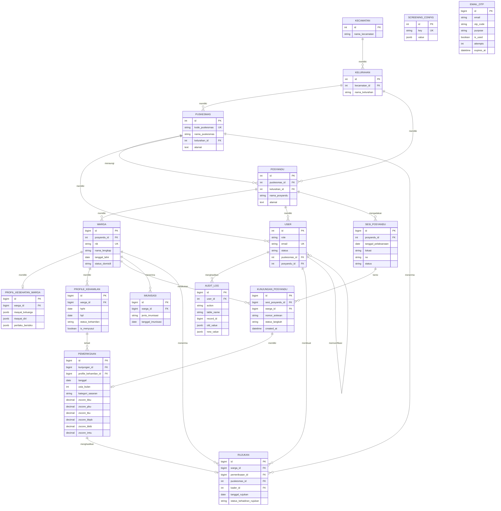

# Database Documentation --- POSYANDU

Dokumentasi ini disusun berdasarkan file migrasi tunggal `20260925020000-create-all-schema.js`.

---

## 1. Ringkasan

Database POSYANDU dikelola menggunakan **PostgreSQL + Sequelize**.

### Jumlah Migration
Terdapat **1 migration** tunggal:
* `20260925020000-create-all-schema.js`

### Tabel yang Dibentuk
Migration ini membentuk **16 tabel**:

1. `kecamatan`
2. `kelurahan`
3. `puskesmas`
4. `posyandu`
5. `warga`
6. `users`
7. `profile_kehamilan`
8. `sesi_posyandu`
9. `kunjungan_posyandu`
10. `pemeriksaan`
11. `audit_log`
12. `email_otp`
13. `imunisasi`
14. `rujukan`
15. `profil_kesehatan_warga`
16. `screening_config`

---

## 2. Detail Skema Tabel

### 2.1 `kecamatan`
| Kolom | Tipe Data | Null | Keterangan |
| :--- | :--- | :--- | :--- |
| `id` | INTEGER | NOT NULL | PK, Auto Increment |
| `nama_kecamatan` | VARCHAR(100) | NOT NULL | Nama kecamatan |

---

### 2.2 `kelurahan`
| Kolom | Tipe Data | Null | Keterangan |
| :--- | :--- | :--- | :--- |
| `id` | INTEGER | NOT NULL | PK, Auto Increment |
| `kecamatan_id` | INTEGER | NOT NULL | FK → `kecamatan.id` |
| `nama_kelurahan` | VARCHAR(100) | NOT NULL | Nama kelurahan |

**Foreign Key & Index:**
* `kelurahan.kecamatan_id` → `kecamatan.id` (`ON UPDATE CASCADE`, `ON DELETE RESTRICT`)
* Index: `idx_kelurahan_kecamatan` pada `(kecamatan_id)`

---

### 2.3 `puskesmas`
| Kolom | Tipe Data | Null | Keterangan |
| :--- | :--- | :--- | :--- |
| `id` | INTEGER | NOT NULL | PK, Auto Increment |
| `kode_puskesmas` | VARCHAR(20) | NOT NULL | UNIQUE |
| `nama_puskesmas` | VARCHAR(100) | NOT NULL | Nama Puskesmas |
| `kelurahan_id` | INTEGER | NOT NULL | FK → `kelurahan.id` |
| `alamat` | TEXT | NULL | Alamat Puskesmas |

**Foreign Key:**
* `puskesmas.kelurahan_id` → `kelurahan.id` (`ON UPDATE CASCADE`, `ON DELETE RESTRICT`)

---

### 2.4 `posyandu`
| Kolom | Tipe Data | Null | Keterangan |
| :--- | :--- | :--- | :--- |
| `id` | INTEGER | NOT NULL | PK, Auto Increment |
| `puskesmas_id` | INTEGER | NOT NULL | FK → `puskesmas.id` |
| `kelurahan_id` | INTEGER | NOT NULL | FK → `kelurahan.id` |
| `nama_posyandu` | VARCHAR(100) | NOT NULL | Nama Posyandu |
| `alamat` | TEXT | NULL | Alamat Posyandu |

**Foreign Key:**
* `posyandu.puskesmas_id` → `puskesmas.id` (`ON UPDATE CASCADE`, `ON DELETE RESTRICT`)
* `posyandu.kelurahan_id` → `kelurahan.id` (`ON UPDATE CASCADE`, `ON DELETE RESTRICT`)

---

### 2.5 `warga`
| Kolom | Tipe Data | Null | Default / Constraint |
| :--- | :--- | :--- | :--- |
| `id` | BIGINT | NOT NULL | PK, Auto Increment |
| `posyandu_id` | INTEGER | NOT NULL | FK → `posyandu.id` |
| `nik` | VARCHAR(16) | NULL | UNIQUE |
| `nama_lengkap` | VARCHAR(100) | NOT NULL | — |
| `jenis_kelamin` | CHAR(1) | NULL | Check (`L`, `P`) |
| `tanggal_lahir` | DATEONLY | NOT NULL | — |
| `alamat` | TEXT | NULL | — |
| `rt` | VARCHAR(5) | NULL | — |
| `rw` | VARCHAR(5) | NULL | — |
| `telepon` | VARCHAR(20) | NULL | — |
| `nama_ibu` | VARCHAR(100) | NULL | — |
| `nama_ayah` | VARCHAR(100) | NULL | — |
| `status_perkawinan` | VARCHAR(20) | NULL | Check (`menikah`, `tidak_menikah`) |
| `pekerjaan` | VARCHAR(50) | NULL | — |
| `pekerjaan_lainnya` | VARCHAR(100) | NULL | — |
| `bb_lahir_kg` | DECIMAL(4,2) | NULL | — |
| `tb_lahir_cm` | DECIMAL(4,2) | NULL | — |
| `status_domisili` | VARCHAR(20) | NULL | Default `'aktif'`, Check (`aktif`, `pindah`, `meninggal`) |
| `created_at` | TIMESTAMP | NULL | Default `CURRENT_TIMESTAMP` |

**Foreign Key, Constraint & Index:**
* `warga.posyandu_id` → `posyandu.id` (`ON UPDATE CASCADE`, `ON DELETE RESTRICT`)
* Check constraints: `chk_warga_jenis_kelamin`, `chk_warga_status_perkawinan`, `chk_warga_status_domisili`
* Index: `idx_warga_posyandu_domisili` pada `(posyandu_id, status_domisili)`
* Index: `idx_warga_mutasi_3faktor` pada `(nik, tanggal_lahir, LOWER(nama_ibu))`

---

### 2.6 `users`
| Kolom | Tipe Data | Null | Default / Constraint |
| :--- | :--- | :--- | :--- |
| `id` | INTEGER | NOT NULL | PK, Auto Increment |
| `role` | VARCHAR(20) | NULL | Check (`kader`, `puskesmas`, `puskesmasAdmin`, `dinkes`, `dinkesAdmin`, `sa`) |
| `email` | VARCHAR(100) | NOT NULL | UNIQUE |
| `password_hash` | VARCHAR(255) | NOT NULL | — |
| `nama_lengkap` | VARCHAR(100) | NOT NULL | — |
| `telepon` | VARCHAR(20) | NULL | — |
| `status` | VARCHAR(20) | NULL | Default `'pending_approval'`, Check (`pending_approval`, `rejected`, `active`, `inactive`) |
| `puskesmas_id` | INTEGER | NULL | FK → `puskesmas.id` |
| `posyandu_id` | INTEGER | NULL | FK → `posyandu.id` |
| `verified_by` | INTEGER | NULL | FK → `users.id` |
| `verified_at` | TIMESTAMP | NULL | — |
| `nik` | VARCHAR(16) | NULL | — |
| `profile_picture` | VARCHAR(255) | NULL | Default `NULL` |
| `token_version` | INTEGER | NOT NULL | Default `1` |
| `email_verified` | BOOLEAN | NOT NULL | Default `false` |
| `email_verified_at`| TIMESTAMP | NULL | — |

**Foreign Key:**
* `users.puskesmas_id` → `puskesmas.id` (`ON UPDATE CASCADE`, `ON DELETE SET NULL`)
* `users.posyandu_id` → `posyandu.id` (`ON UPDATE CASCADE`, `ON DELETE SET NULL`)
* `users.verified_by` → `users.id` (`ON UPDATE CASCADE`, `ON DELETE SET NULL`)

---

### 2.7 `profile_kehamilan`
| Kolom | Tipe Data | Null | Default / Constraint |
| :--- | :--- | :--- | :--- |
| `id` | BIGINT | NOT NULL | PK, Auto Increment |
| `warga_id` | BIGINT | NOT NULL | FK → `warga.id` |
| `nama_suami` | VARCHAR(100) | NULL | — |
| `hpht` | DATEONLY | NULL | — |
| `hpl` | DATEONLY | NULL | — |
| `anak_ke` | INTEGER | NULL | — |
| `jarak_anak_sebelum_bulan` | INTEGER | NULL | — |
| `tanggal_persalinan` | DATEONLY | NULL | — |
| `cara_persalinan` | VARCHAR(30) | NULL | Check (`normal`, `dengan_tindakan`) |
| `status_kehamilan` | VARCHAR(20) | NULL | Check (`hamil`, `nifas`, `menyusui`, `selesai`) |
| `is_menyusui` | BOOLEAN | NOT NULL | Default `false` |

**Foreign Key & Index:**
* `profile_kehamilan.warga_id` → `warga.id` (`ON UPDATE CASCADE`, `ON DELETE CASCADE`)
* Index: `idx_profile_kehamilan_warga_status` pada `(warga_id, status_kehamilan)`
* Unique Partial Index: `uq_profile_kehamilan_active_hamil` pada `(warga_id)` WHERE `status_kehamilan = 'hamil'`

---

### 2.8 `sesi_posyandu`
| Kolom | Tipe Data | Null | Default / Constraint |
| :--- | :--- | :--- | :--- |
| `id` | BIGINT | NOT NULL | PK, Auto Increment |
| `posyandu_id` | INTEGER | NOT NULL | FK → `posyandu.id` |
| `tanggal_pelaksanaan` | DATEONLY | NOT NULL | — |
| `status` | VARCHAR(10) | NULL | Default `'open'`, Check (`open`, `closed`) |
| `lokasi` | VARCHAR(255) | NOT NULL | — |
| `rw` | VARCHAR(5) | NOT NULL | — |

**Foreign Key & Constraints:**
* `sesi_posyandu.posyandu_id` → `posyandu.id` (`ON UPDATE CASCADE`, `ON DELETE RESTRICT`)
* Unique Constraint: `uq_sesi_posyandu_tanggal` pada `(posyandu_id, tanggal_pelaksanaan)`
* Index: `idx_sesi_posyandu_status` pada `(posyandu_id, status, tanggal_pelaksanaan)`

---

### 2.9 `kunjungan_posyandu`
| Kolom | Tipe Data | Null | Default / Constraint |
| :--- | :--- | :--- | :--- |
| `id` | BIGINT | NOT NULL | PK, Auto Increment |
| `sesi_posyandu_id` | BIGINT | NOT NULL | FK → `sesi_posyandu.id` |
| `warga_id` | BIGINT | NOT NULL | FK → `warga.id` |
| `nomor_antrean` | VARCHAR(10) | NOT NULL | — |
| `status_langkah` | VARCHAR(20) | NULL | Default `'langkah_1'`, Check (`langkah_1`, `langkah_2`, `langkah_3`, `langkah_4`, `langkah_5`) |
| `created_at` | TIMESTAMP | NOT NULL | Default `CURRENT_TIMESTAMP` |

**Foreign Key & Constraints:**
* `kunjungan_posyandu.sesi_posyandu_id` → `sesi_posyandu.id` (`ON UPDATE CASCADE`, `ON DELETE CASCADE`)
* `kunjungan_posyandu.warga_id` → `warga.id` (`ON UPDATE CASCADE`, `ON DELETE RESTRICT`)
* Unique Constraints: `uq_kunjungan_sesi_warga` pada `(sesi_posyandu_id, warga_id)` & `uq_kunjungan_sesi_antrean` pada `(sesi_posyandu_id, nomor_antrean)`
* Index: `idx_kunjungan_antrean` pada `(sesi_posyandu_id, nomor_antrean)`

---

### 2.10 `pemeriksaan`
| Kolom | Tipe Data | Null | Default / Constraint |
| :--- | :--- | :--- | :--- |
| `id` | BIGINT | NOT NULL | PK, Auto Increment |
| `kunjungan_id` | BIGINT | NOT NULL | UNIQUE, FK → `kunjungan_posyandu.id` |
| `profile_kehamilan_id` | BIGINT | NULL | FK → `profile_kehamilan.id` |
| `tanggal` | DATEONLY | NOT NULL | Default `CURRENT_DATE` |
| `usia_bulan` | INTEGER | NOT NULL | — |
| `kategori_sasaran` | VARCHAR(20) | NULL | Check (`bumil`, `busui`, `bayi`, `balita`, `apras`, `uskrem_6_14`, `uskrem_15_18`, `dewasa`, `lansia`) |
| `bb_kg` | DECIMAL(5,2) | NULL | Check (`bb_kg IS NULL OR bb_kg > 0`) |
| `tb_cm` | DECIMAL(5,2) | NULL | Check (`tb_cm IS NULL OR tb_cm > 0`) |
| `lingkar_kepala_cm` | DECIMAL(4,2) | NULL | — |
| `lila_cm` | DECIMAL(4,2) | NULL | — |
| `lingkar_perut_cm` | DECIMAL(5,2) | NULL | — |
| `td_sistole` | INTEGER | NULL | Check (`td_sistole IS NULL OR td_sistole > 0`) |
| `td_diastole` | INTEGER | NULL | Check (`td_diastole IS NULL OR td_diastole > 0`) |
| `kadar_gula` | INTEGER | NULL | — |
| `zscore_bbu` | DECIMAL(8,4) | NULL | — |
| `zscore_pbu` | DECIMAL(8,4) | NULL | — |
| `zscore_tbu` | DECIMAL(8,4) | NULL | — |
| `zscore_bbpb` | DECIMAL(8,4) | NULL | — |
| `zscore_bbtb` | DECIMAL(8,4) | NULL | — |
| `zscore_imtu` | DECIMAL(8,4) | NULL | — |
| `detail_skrining` | JSONB | NULL | Default `{}` |
| `screening_history` | JSONB | NOT NULL | Default `[]` |
| `topik_penyuluhan` | TEXT | NULL | — |
| `is_perlu_rujukan` | BOOLEAN | NULL | Default `false` |
| `step2_completed_at` | TIMESTAMP | NULL | — |
| `step4_completed_at` | TIMESTAMP | NULL | — |
| `step5_completed_at` | TIMESTAMP | NULL | — |
| `created_at` | TIMESTAMP | NULL | Default `CURRENT_TIMESTAMP` |

**Foreign Key & Index:**
* `pemeriksaan.kunjungan_id` → `kunjungan_posyandu.id` (`ON UPDATE CASCADE`, `ON DELETE CASCADE`)
* `pemeriksaan.profile_kehamilan_id` → `profile_kehamilan.id` (`ON UPDATE CASCADE`, `ON DELETE SET NULL`)
* Index: `idx_pemeriksaan_kategori_tanggal` pada `(kategori_sasaran, tanggal)`
* Index GIN: `idx_pemeriksaan_detail_skrining_gin` pada `detail_skrining`

---

### 2.11 `audit_log`
| Kolom | Tipe Data | Null | Default / Keterangan |
| :--- | :--- | :--- | :--- |
| `id` | BIGINT | NOT NULL | PK, Auto Increment |
| `user_id` | INTEGER | NULL | FK → `users.id` |
| `action` | VARCHAR(50) | NOT NULL | — |
| `table_name` | VARCHAR(50) | NOT NULL | — |
| `record_id` | BIGINT | NULL | — |
| `old_value` | JSONB | NULL | — |
| `new_value` | JSONB | NULL | — |
| `created_at` | TIMESTAMP | NULL | Default `CURRENT_TIMESTAMP` |

**Foreign Key & Index:**
* `audit_log.user_id` → `users.id` (`ON UPDATE CASCADE`, `ON DELETE SET NULL`)
* Index: `idx_audit_log_record` pada `(table_name, record_id)`

---

### 2.12 `email_otp`
| Kolom | Tipe Data | Null | Default / Constraint |
| :--- | :--- | :--- | :--- |
| `id` | BIGINT | NOT NULL | PK, Auto Increment |
| `email` | VARCHAR(100)| NOT NULL | — |
| `otp_code` | VARCHAR(10) | NOT NULL | — |
| `purpose` | VARCHAR(30) | NULL | Check (`register`, `reset_password`) |
| `is_used` | BOOLEAN | NULL | Default `false` |
| `attempts` | INTEGER | NULL | Default `0` |
| `expires_at` | TIMESTAMP | NOT NULL | — |

**Index:**
* Index: `idx_email_otp_lookup` pada `(email, purpose, is_used, expires_at)`

---

### 2.13 `imunisasi`
| Kolom | Tipe Data | Null | Keterangan |
| :--- | :--- | :--- | :--- |
| `id` | BIGINT | NOT NULL | PK, Auto Increment |
| `warga_id` | BIGINT | NOT NULL | FK → `warga.id` |
| `jenis_imunisasi` | VARCHAR(100) | NOT NULL | — |
| `tanggal_imunisasi` | DATEONLY | NOT NULL | — |

**Foreign Key & Index:**
* `imunisasi.warga_id` → `warga.id` (`ON UPDATE CASCADE`, `ON DELETE CASCADE`)
* Index: `idx_imunisasi_warga_tanggal` pada `(warga_id, tanggal_imunisasi)`

---

### 2.14 `rujukan`
| Kolom | Tipe Data | Null | Default / Constraint |
| :--- | :--- | :--- | :--- |
| `id` | BIGINT | NOT NULL | PK, Auto Increment |
| `warga_id` | BIGINT | NOT NULL | FK → `warga.id` |
| `pemeriksaan_id` | BIGINT | NOT NULL | UNIQUE, FK → `pemeriksaan.id` |
| `puskesmas_id` | INTEGER | NOT NULL | FK → `puskesmas.id` |
| `kader_id` | INTEGER | NOT NULL | FK → `users.id` |
| `tanggal_rujukan` | DATEONLY | NOT NULL | — |
| `alasan_rujukan` | TEXT | NOT NULL | — |
| `status_kehadiran_rujukan` | VARCHAR(20) | NULL | Check (`hadir`, `tidak_hadir`) |
| `created_at` | TIMESTAMP | NOT NULL | Default `CURRENT_TIMESTAMP` |
| `updated_at` | TIMESTAMP | NOT NULL | Default `CURRENT_TIMESTAMP` |

**Foreign Key & Index:**
* `rujukan.warga_id` → `warga.id` (`ON UPDATE CASCADE`, `ON DELETE RESTRICT`)
* `rujukan.pemeriksaan_id` → `pemeriksaan.id` (`ON UPDATE CASCADE`, `ON DELETE CASCADE`)
* `rujukan.puskesmas_id` → `puskesmas.id` (`ON UPDATE CASCADE`, `ON DELETE RESTRICT`)
* `rujukan.kader_id` → `users.id` (`ON UPDATE CASCADE`, `ON DELETE RESTRICT`)
* Index: `idx_rujukan_warga_id` pada `(warga_id)`
* Index: `idx_rujukan_puskesmas_tanggal` pada `(puskesmas_id, tanggal_rujukan)`

---

### 2.15 `profil_kesehatan_warga`
| Kolom | Tipe Data | Null | Default / Constraint |
| :--- | :--- | :--- | :--- |
| `id` | BIGINT | NOT NULL | PK, Auto Increment |
| `warga_id` | BIGINT | NOT NULL | UNIQUE, FK → `warga.id` |
| `riwayat_keluarga` | JSONB | NOT NULL | Default `{}` |
| `riwayat_diri` | JSONB | NOT NULL | Default `{}` |
| `perilaku_berisiko` | JSONB | NOT NULL | Default `{}` |
| `created_at` | TIMESTAMP | NOT NULL | Default `CURRENT_TIMESTAMP` |
| `updated_at` | TIMESTAMP | NOT NULL | Default `CURRENT_TIMESTAMP` |

**Foreign Key & Index:**
* `profil_kesehatan_warga.warga_id` → `warga.id` (`ON UPDATE CASCADE`, `ON DELETE CASCADE`)
* Unique Index: `idx_profil_kesehatan_warga_warga_id` pada `(warga_id)`

---

### 2.16 `screening_config`
| Kolom | Tipe Data | Null | Default / Constraint |
| :--- | :--- | :--- | :--- |
| `id` | INTEGER | NOT NULL | PK, Auto Increment |
| `key` | VARCHAR(100) | NOT NULL | UNIQUE |
| `value` | JSONB | NOT NULL | — |
| `created_at` | TIMESTAMP | NOT NULL | Default `CURRENT_TIMESTAMP` |
| `updated_at` | TIMESTAMP | NOT NULL | Default `CURRENT_TIMESTAMP` |

**Index:**
* Unique Index: `screening_config_key_unique` pada `(key)`

---

## 3. Operations & Backfill pada Migrasi

Pada bagian akhir fungsi `up()`, migrasi secara otomatis melakukan pembaruan data awal (backfill):
* Memperbarui tabel `users` untuk penggunanya yang memiliki `status = 'active'`:
  * `email_verified` = `true`
  * `email_verified_at` = `CURRENT_TIMESTAMP`

---

## 4. Entity Relationship Diagram (ERD)

---

## 5. Ringkasan Constraints & Index

### Unique & Partial Constraints
| Nama / Keterangan | Tabel | Kolom |
| :--- | :--- | :--- |
| `UNIQUE` | `puskesmas` | `kode_puskesmas` |
| `UNIQUE` | `warga` | `nik` |
| `UNIQUE` | `users` | `email` |
| `uq_profile_kehamilan_active_hamil` | `profile_kehamilan` | Unique `warga_id` WHERE `status_kehamilan = 'hamil'` |
| `uq_sesi_posyandu_tanggal` | `sesi_posyandu` | `posyandu_id, tanggal_pelaksanaan` |
| `uq_kunjungan_sesi_warga` | `kunjungan_posyandu` | `sesi_posyandu_id, warga_id` |
| `uq_kunjungan_sesi_antrean` | `kunjungan_posyandu` | `sesi_posyandu_id, nomor_antrean` |
| `UNIQUE` | `pemeriksaan` | `kunjungan_id` |
| `UNIQUE` | `rujukan` | `pemeriksaan_id` |
| `idx_profil_kesehatan_warga_warga_id` | `profil_kesehatan_warga` | Unique `warga_id` |
| `screening_config_key_unique` | `screening_config` | Unique `key` |

### Check Constraints
| Check Constraint Name | Tabel | Nilai yang Diperbolehkan / Formula |
| :--- | :--- | :--- |
| `chk_warga_jenis_kelamin` | `warga` | `'L'`, `'P'` |
| `chk_warga_status_perkawinan` | `warga` | `'menikah'`, `'tidak_menikah'` |
| `chk_warga_status_domisili` | `warga` | `'aktif'`, `'pindah'`, `'meninggal'` |
| `chk_users_role` | `users` | `'kader'`, `'puskesmas'`, `'puskesmasAdmin'`, `'dinkes'`, `'dinkesAdmin'`, `'sa'` |
| `chk_users_status` | `users` | `'pending_approval'`, `'rejected'`, `'active'`, `'inactive'` |
| `chk_kehamilan_cara_persalinan` | `profile_kehamilan` | `'normal'`, `'dengan_tindakan'` |
| `chk_kehamilan_status` | `profile_kehamilan` | `'hamil'`, `'nifas'`, `'menyusui'`, `'selesai'` |
| `chk_sesi_status` | `sesi_posyandu` | `'open'`, `'closed'` |
| `chk_kunjungan_status_langkah` | `kunjungan_posyandu` | `'langkah_1'`, `'langkah_2'`, `'langkah_3'`, `'langkah_4'`, `'langkah_5'` |
| `chk_pemeriksaan_kategori` | `pemeriksaan` | `'bumil'`, `'busui'`, `'bayi'`, `'balita'`, `'apras'`, `'uskrem_6_14'`, `'uskrem_15_18'`, `'dewasa'`, `'lansia'` |
| `chk_pemeriksaan_bb` | `pemeriksaan` | `bb_kg IS NULL OR bb_kg > 0` |
| `chk_pemeriksaan_tb` | `pemeriksaan` | `tb_cm IS NULL OR tb_cm > 0` |
| `chk_pemeriksaan_sistole` | `pemeriksaan` | `td_sistole IS NULL OR td_sistole > 0` |
| `chk_pemeriksaan_diastole` | `pemeriksaan` | `td_diastole IS NULL OR td_diastole > 0` |
| `chk_otp_purpose` | `email_otp` | `'register'`, `'reset_password'` |
| `chk_rujukan_status_kehadiran` | `rujukan` | `'hadir'`, `'tidak_hadir'` |

---

## 6. Prosedur Down (Rollback)

Prosedur `down()` menghapus skema dengan urutan kebalikan dari dependensi foreign key:
1. Menghapus raw index SQL: `"uq_profile_kehamilan_active_hamil"` dan `"idx_warga_mutasi_3faktor"`.
2. Menghapus tabel secara berurutan: `screening_config`, `profil_kesehatan_warga`, `rujukan`, `imunisasi`, `email_otp`, `audit_log`, `pemeriksaan`, `kunjungan_posyandu`, `sesi_posyandu`, `profile_kehamilan`, `users`, `warga`, `posyandu`, `puskesmas`, `kelurahan`, `kecamatan`.